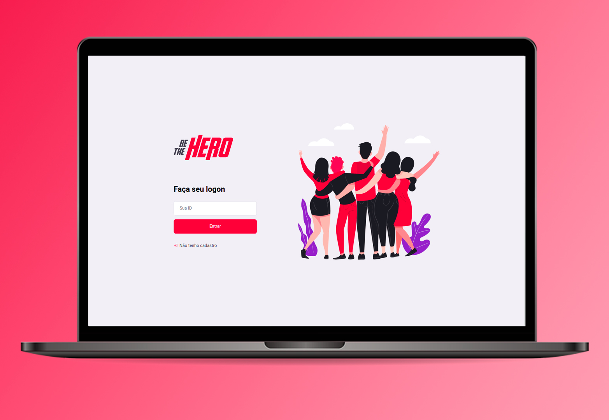

<h1 align="center">
    Semana OmniStack #11
</h1>

> Código da aplicação desenvolvida pela semana Omnistack #11




## Introdução

A semana OmniStack é uma semana onde é ensinado a teoria e a pratica do desenvolvimento de APPs utilizando tecnologias como: **NodeJs, ReactJS e React Native**. 
Com o foco no aprendizado do aluno a [Rocketseat](https://rocketseat.com.br/) faz um excelente trabalho disponibilizando o material totalmente gratuito durante uma semana para a execução continua do projeto.


## GO TE HERO

Go The Hero é a aplicação para heróis encontrar casos de ONGs afim de ajuda-las. ONGs podem cadastrar casos que precisam de apoio financeiro, estes casos ficam disponiveis na versão mobile para algum herói posso contribuir com este caso.

Durante a execução deste projeto vale destacar a manipulação das seguintes tecnologias:
 - MiniFramework Express
 - ReactJS
 - Routes
 - Axios
 - KNEX


## Pré-requisitos

Para a execução da aplicação será necessario ter instalado em sua máquina:
 - Node.js
 - NPM (Gerenciador de dependências do Node) ou YARN

## Instalação

Será necessario realizar o seguinte comando dentro do diretório ```backend``` e ``frontend` para a instalação de todas as dependências necessarias:

Caso esteja utilizando NPM:

```sh
npm install
```
Caso esteja utilizando YARN:

```sh
yarn
```


## Execução

Para a execução da aplicação basta realizar o seguinte comando em seu terminal:

Caso esteja utilizando NPM:

```sh
npm start
```
Caso esteja utilizando YARN:

```sh
yarn start
```


## Status do projeto

 - **EM ANDAMENTO**

## Autor

Guilherme Selair – [@GuiSelair](https://github.com/GuiSelair)

# Referência
 Curso ministrado pela empresa [Rocketseat](https://rocketseat.com.br/) pelo professor [Diego Fernandes](https://github.com/diego3g).

 Parte desse conteúdo foi retirado do repositório oficial da semana OmniStack 11, [ACESSE AQUI](https://github.com/Rocketseat/semana-omnistack-11)